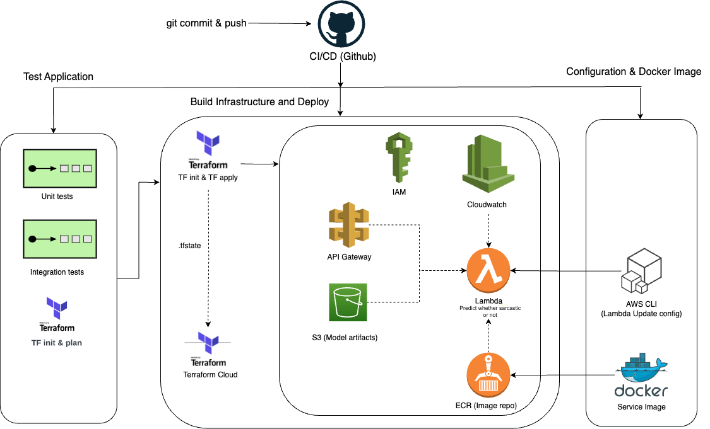
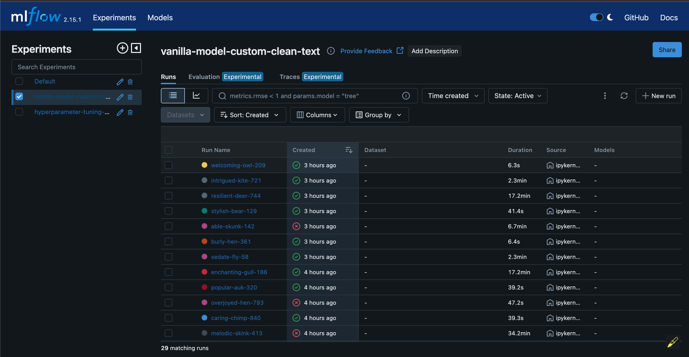
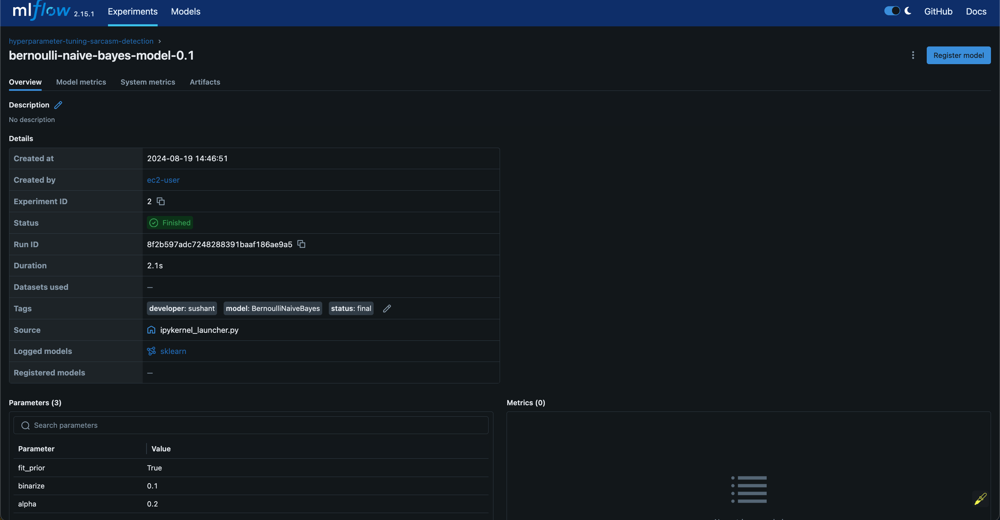

# Sarcasm Detection

This project is a part of the [MLOps Zoomcamp](https://github.com/DataTalksClub/mlops-zoomcamp/tree/main) Project. The aim of the project is to build an end-to-end mlops pipeline.


## Table of Content

- [Text Analyzer](#text-analyzer)
  - [Table of Content](#table-of-content)
  - [Problem Statement](#problem-statement)
  - [Pre-requisites](#pre-requisites)
  - [Infrastructure](#infrastructure)
  - [Setup EC2](#setup-ec2)
  - [Exploratory Data Analysis and Modeling](#exploratory-data-analysis-and-modeling)
  - [Setup the environment](#setup-the-environment)
    - [MLflow Tracking](#mlflow-tracking)
  - [Deployment](#deployment)
  - [Model Monitoring](#model-monitoring)
  - [CI-CD Pipeline](#ci-cd-pipeline)
  - [Best Practices](#best-practices)
  - [Tests](#tests)
  - [User Interface](#user-interface)


## Problem Statement

In the era of information overload, understanding the true intent behind text content is crucial. `Sarcasm`, a form of verbal irony where the intended meaning is opposite to the literal meaning, can distort the interpretation of news headlines. In this project, we aim to develop a text classification model that detects sarcasm in news headlines. The model will classify headlines into two categories: `Sarcastic` and `Non-Sarcastic`.

The dataset - [News Headlines Dataset for Sarcasm Detection](https://www.kaggle.com/datasets/rmisra/news-headlines-dataset-for-sarcasm-detection) for this project consists of a collection of news headlines sourced from various media outlets, where each headline is labeled as either sarcastic or non-sarcastic. The goal is to train a machine learning model to accurately classify whether a given headline contains sarcasm.

Why Sarcasm Detection Matters:

- Improved Content Understanding: Detecting sarcasm can enhance the comprehension of news content, ensuring that readers interpret the headlines as intended by the author.

- Enhanced User Experience: For media organizations and social media platforms, accurate sarcasm detection can improve content recommendations and user engagement by filtering out misleading or emotionally charged headlines.

- Sentiment Analysis Accuracy: In sentiment analysis applications, sarcasm can significantly skew results. By identifying sarcastic headlines, the accuracy of sentiment-based insights can be improved.

- Automated Content Moderation: Sarcasm detection can be used in automated systems to flag or review content that might be misleading or offensive, aiding in content moderation efforts.

- Crisis Management: In situations where headlines could influence public sentiment, such as during crises or political events, sarcasm detection can help in understanding the underlying tone and intent of the information being disseminated.

This project aims to leverage advanced natural language processing techniques and machine learning algorithms to develop a robust sarcasm detection system that can be applied across various platforms and contexts.

## Pre-requisites

The following tools are required to run the project:

- [AWS CLI](https://docs.aws.amazon.com/cli/latest/userguide/cli-chap-install.html)
- [Terraform](https://learn.hashicorp.com/tutorials/terraform/install-cli)
- [Docker](https://docs.docker.com/get-docker/)
- [Python](https://www.python.org/downloads/)

You will also need an AWS account, Terraform Cloud account, and Prefect Cloud account.

This user acts as the admin for the project and will be used to create the infrastructure. However when the infrastructure is created each service will have its own IAM role with the least required permissions.

Next, you'll need to create an access key for the user. This will give you the `AWS_ACCESS_KEY` and `AWS_SECRET_ACCESS_KEY` which you'll need to configure the AWS CLI. You can configure the AWS CLI using the command `aws configure`. You'll need to provide the `AWS_ACCESS_KEY` and `AWS_SECRET_ACCESS_KEY` along with the `AWS_REGION` and `AWS_OUTPUT_FORMAT`.

Create AWS EC2 key pair and download the `.pem` file. This will be used to ssh into the EC2 instance. Follow the instructions [here](https://docs.aws.amazon.com/AWSEC2/latest/UserGuide/create-key-pairs.html#having-ec2-create-your-key-pair) to create the key pair. Save the `.pem` file in the `~/.ssh` directory.

In the file `terraform/moddules/ec2_rds/variables.tf` update the `key_name` variable with the name of the key pair you created at `line 44`.

In the ~/.ssh/config file add the following lines:

```bash
Host ec2
    HostName <ec2_public_ip>
    User ec2-user
    IdentityFile ~/.ssh/<key_pair_name>.pem
```

## Infrastructure



The project is deployed on AWS using the following services:

- [AWS S3](https://aws.amazon.com/s3/) for storing the data and model artifacts.
- [AWS RDS](https://aws.amazon.com/rds/) as the MLflow tracking server.
- [AWS Lambda](https://aws.amazon.com/lambda/) for running the inference code.
- [AWS API Gateway](https://aws.amazon.com/api-gateway/) for creating the API endpoint.
- [AWS ECR](https://aws.amazon.com/ecr/) for storing the docker image.
- [AWS EC2](https://aws.amazon.com/ec2/) for building the project.
- [AWS IAM](https://aws.amazon.com/iam/) for managing the permissions.

The infrastructure is managed using Terraform. The Terraform code is located in the `terraform` directory.

Below are some terraform cloud comamnds:

- Login to Terraform Cloud: `terraform login`
- Create new workspace: `terraform workspace new <workspace_name>`
- Select workspace: `terraform workspace select <workspace_name>`
- List workspaces: `terraform workspace list`
- Delete workspace: `terraform workspace delete <workspace_name>`
- Show workspace: `terraform workspace show`

### Steps to deploy the infrastructure:

1. Open terminal or command prompt and move to the `terraform` directory.
2. Login to Terraform Cloud using the command `terraform login`.
3. Create three workspaces: `dev`, `staging`, and `prod`. Examples: `terraform workspace new dev`. We'll work in the `dev` workspace.
4. For each workspace in the terraform cloud, change the `Execution Mode` to `Local`.
   - Open the browser and go to the terraform cloud.
   - Select the workspace, Click on `Settings`.
   - In `General` tab, change the `Execution Mode` to `Local`, and click on `Save Settings`.
5. In the `terraform/modules/vars` directory create a file `secrets.tfvars` that will contain the following values:
   - `aws_access_key` = `<AWS_ACCESS_KEY>`
   - `aws_secret_key` = `<AWS_SECRET_ACCESS_KEY>`
   - `db_username` = `<DB_USERNAME>` # RDS postgres username
   - `db_password` = `<DB_PASSWORD>` # RDS postgres password
6. In the terminal or command prompt, run the command `terraform init`.
7. Terraform plan: `terraform plan -var-file="./modules/vars/dev.tfvars" -var-file="./modules/vars/secrets.tfvars"`
8. Terraform apply: `terraform apply -var-file="./modules/vars/dev.tfvars" -var-file="./modules/vars/secrets.tfvars"`
9. Terraform destroy: `terraform destroy -var-file="./modules/vars/dev.tfvars" -var-file="./modules/vars/secrets.tfvars"`

## Setup EC2

We'll move to EC2 instance to work on the rest of the project. You can connect to the EC2 instance using the using VS Code Remote SSH extension or following command:

```bash
ssh ec2-user@ec2
```

- Git clone the project on the EC2 instance using the `git clone` command.

- Make sure `make` is installed on the EC2 instance. If not, install it using the following command:

```bash
sudo yum install make
sudo yum install git # Also install git if not installed
```

````

### Install all the tools and dependencies

```bash
make install-software
make setup
````
## Exploratory Data Analysis and Modeling

The exploratory data analysis and modeling is done in the `notebooks` directory. The exploratory data analysis and modeling is done in the `EDA_plus_modeling.ipynb` notebook.

### MLflow Tracking

The MLflow tracking server is deployed on AWS RDS. The MLflow tracking server is used to track the model training runs. Also, MLflow artifacts are stored on AWS S3.

To start the MLflow tracking server, run the following command:

```bash
mlflow server -h 0.0.0.0 -p 5000 --backend-store-uri postgresql://DB_USER:DB_PASSWORD@DB_ENDPOINT:5432/DB_NAME --default-artifact-root s3://S3_BUCKET_NAME
```

You can find the DB_USER and DB_PASSWORD in the `secrets.tfvars` file. You can find the DB_ENDPOINT on the AWS RDS console. ENDPOINT format would be `<DB_NAME>.<RANDOM_STRING>.<REGION>.rds.amazonaws.com`. You can find the DB_NAME on the AWS RDS console.

Note: Add port 5000 for port forwarding in VS Code.

Below you can find the MLflow UI screenshot of the model training runs:



MLflow Logged Model:

You can view in the below image that the model is logged in the S3 bucket.




## Deployment

The deployment is done using AWS Lambda and AWS API Gateway. We deploy the docker image to AWS ECR which is used by the AWS Lambda function. The AWS Lambda function is invoked by the AWS API Gateway endpoint.

To deploy our model, we'll need to convert our notebooks to python scripts. Also, create python environment file `Pipfile` and `Pipfile.lock` with all the dependencies. Then we'll create a docker image and push it to AWS ECR.

All the deployment related code is located in the `deployment` directory.

Following best practices for deploying machine learning models, we don't have to manually create the image and push it to AWS ECR.

## Model Monitoring

Work in Progress

## CI-CD Pipeline

Work in Progress

## Best Practices

Following the best practices of software development, I have created a `Makefile` to automate the quality checks and other tasks.

Quality Checks includes the following:

- `black`: Code Formatter
- `pylint`: Code Linter
- `isort`: Import Sorter
- `trailingspaces`: Trailing Whitespace Remover
- `end-of-file-fixer`: End of File Fixer
- `check-yaml`: YAML Linter

To run the quality checks, run the following command:

```bash
make quality-checks
```

We have also incorporated `pre-commit` hooks to run the quality checks before every commit. To install the `pre-commit` hooks, run the following command:

```bash
make setup
```

## Tests

We have written unit tests located in the `tests` directory. To run the unit tests, run the following command:

```bash
make test
```
## User Interface

Work in Progress